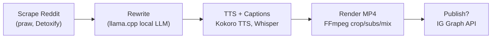

# Reels Factory 🎬

An end-to-end pipeline for generating 9:16 short-form narrated reels (story voiceover + addictive gameplay background). Scrape Reddit-style stories, rewrite them into a 60-second narration, generate TTS + captions, render vertical MP4s, and optionally publish via the Instagram Graph API.

**Examples:** test reels live at https://www.instagram.com/fr.mngr/

## Why it exists
Scrolling users decide in seconds. This project automates the busywork of sourcing, rewriting, voicing, captioning, and rendering so you can iterate on format and storytelling instead of manual editing.

## Pipeline at a glance


## Repo layout
- `src/reels_factory/` – all code (CLI, ingest, rewrite, render, publish helpers).
- `src/reels_factory/ingest.py` – ingest/filter stories (praw, Detoxify, optional llama.cpp gender detection).
- `src/reels_factory/rewrite.py` – rewrite + hashtags (local llama.cpp).
- `src/reels_factory/render.py` – TTS (Kokoro), subtitles (Whisper), ffmpeg render.
- `src/reels_factory/instagram_api.py`, `src/reels_factory/flask_oauth.py` – optional IG upload flow.
- `config/` – config templates (`config.example.json`).
- `docs/` – architecture + publishing notes.
- `output/` – generated artifacts (audio, captions, reels, logs).
- `videos/` – local background clips (kept out of git; see `docs/assets.md` for guidance).
- `models/` – local LLM/Whisper/Kokoro weights (kept out of git; see `docs/llm.md`).

## Setup
1. **System deps**
   - Python 3.10+
   - `ffmpeg` + `ffprobe` on PATH
   - CUDA GPU strongly recommended for Whisper/Detoxify/torch
2. **Install Python deps**
   ```bash
   python -m venv .venv
   source .venv/bin/activate   # or .venv\Scripts\activate on Windows
   pip install -r requirements.txt
   pip install -e .             # add reels_factory to your PYTHONPATH
   ```
3. **Configure secrets**
   - Copy `config/config.example.json` → `config/config.json` and fill values **OR** set env vars from `.env.example`.
   - Keep real keys out of git; `.gitignore` already ignores `config/*.json`, `.env`, and tokens.
4. **Assets**
   - Place gameplay clips under `videos/` (default glob `videos/*.mp4`).
   - Download your LLM/Whisper/Kokoro models to `models/` (or adjust paths).
   - Background sourcing tips live in `docs/assets.md`; keep large media out of git.

## Running the pipeline (examples)
- Scrape only  
  `python -m reels_factory.cli scrape --config-path config/config.json`

- Rewrite only (top N posts)  
  `python -m reels_factory.cli rewrite --limit 10`

- Generate one reel end-to-end  
  `python -m reels_factory.cli generate --limit 1`

- Batch mode (scrape → rewrite → generate)  
  `make scrape && make rewrite && make generate`

- Publish prepared MP4s in `output/to_publish/`  
  `make publish`

- Run unit tests  
  `pytest -q`

## Configuration knobs
- `reddit_scraper`: subreddits, filters (`top/new/controversial`), post length thresholds, normalization regex, toxicity thresholds.
- `video_generation`: caption delay, TTS speed per gender, Whisper model size, background video glob, output root.
- Env vars override secrets: `REDDIT_CLIENT_ID`, `REDDIT_CLIENT_SECRET`, `INSTAGRAM_*` (see `.env.example`).
- Caption styling lives in `video_generation.convert_vtt_to_ass` (font, size, outline, alignment).

## Outputs & determinism
- Raw posts: `output/top_reddit_stories.parquet`
- Rewrites: `output/rewritten_posts.parquet`
- Audio/Subtitles: `output/narration/<REEL_ID>.wav|.vtt|.ass`
- Final reels: `output/reels/<REEL_ID>.mp4`
- Logs: `output/logs/pipeline.log`
- Reel IDs are deterministic hashes of the title via `reels_factory.utils.reel_id_from_title`.

## Safety & content filtering
- Toxicity scores (Detoxify) are captured during scrape; thresholding is configurable.
- Normalization/censoring patterns prevent obvious policy violations in captions.
- **Disclaimer:** review generated stories, audio, and captions before publishing. You are responsible for platform compliance and local laws.

## Notes on publishing
- Instagram Graph API publishing requires: Business/Creator account, linked FB Page, app permissions (`instagram_business_content_publish`), and a long-lived token. See `docs/publishing-notes.md` for the gotchas.
- The included publisher spins up a local HTTP server and uses `ngrok` so Meta can fetch the video. Keep tokens outside of version control.

## Contributing / next steps
- Add moderation gates (keyword blocklist, stricter toxicity thresholds).
- Swap in lighter models for CPU-only runs.
- Add more tests (text normalization, caption timing).
- Experiment with alternative voices/backgrounds for A/B tests.
