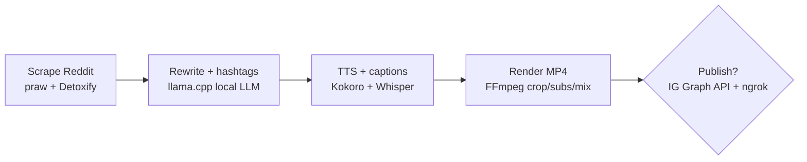

# Architecture Overview

This repo is organized as a pipeline that can be run end-to-end or step-by-step through `reels_factory/cli.py`.

## Stages and tech

- **Ingest** (`reels_factory.ingest`)  
  - `praw` for subreddit fetch  
  - `Detoxify` (Torch) for toxicity scores  
  - Optional narrator gender via local `llama.cpp`  
  - Outputs: `output/top_reddit_stories.parquet`

- **Rewrite** (`reels_factory.rewrite`)  
  - Local `llama.cpp` (GGUF) for rewrite/hook/hashtags  
  - Keep outputs short (~60s narration)  
  - Outputs: `output/rewritten_posts.parquet`

- **Voice + Captions + Render** (`reels_factory.render`)  
  - `Kokoro` TTS for narration  
  - `Whisper` for subtitles with word timings  
  - VTT→ASS styling (9:16 friendly)  
  - `FFmpeg` crops gameplay to vertical, overlays subs, mixes audio  
  - Outputs: `output/reels/*.mp4`, `output/narration/*.wav|*.vtt|*.ass`

- **Publish (optional)** (`reels_factory.instagram_api`, `reels_factory.flask_oauth`)  
  - IG Graph API upload, served via local HTTP + `ngrok`  
  - Requires Business/Creator account + long-lived token

## Data & artifacts
- Raw posts: `output/top_reddit_stories.parquet`
- Rewrites: `output/rewritten_posts.parquet`
- Audio/Subtitles: `output/narration/*.wav|*.vtt|*.ass`
- Final reels: `output/reels/*.mp4`
- Logs: `output/logs/pipeline.log`

## Extending
- Swap background sources via `assets.background_glob` in config.
- Tweak caption styling in `reels_factory.render.convert_vtt_to_ass`.
- Swap TTS voices in `reels_factory.render.generate_tts`.
- Add moderation gates in `reels_factory.ingest`.
